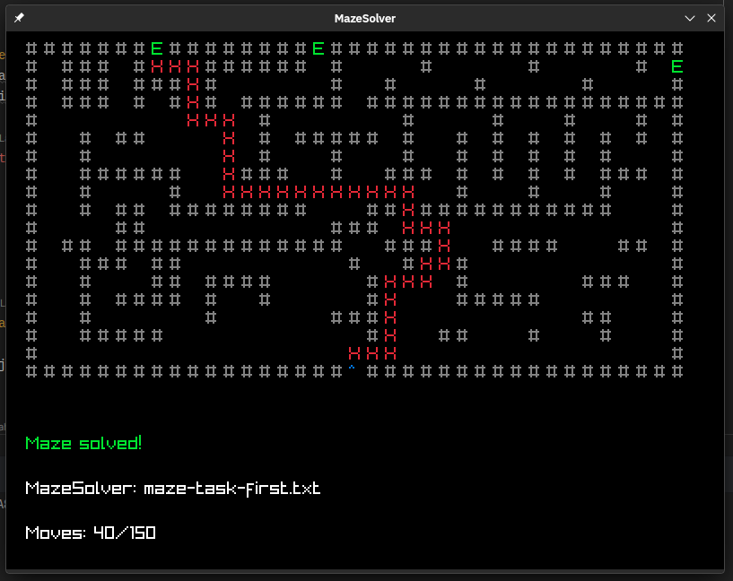

# Maze Solver



This C# project takes a maze inside a text file, parses it and then uses A* pathfinding
to get the shortest route from start to end.

I followed this tutorial to get myself started: [https://dotnetcoretutorials.com/2020/07/25/a-search-pathfinding-algorithm-in-c/](https://dotnetcoretutorials.com/2020/07/25/a-search-pathfinding-algorithm-in-c/)

The mazes can be constructed with following characters:

```
    Block = '#'
    Path = ' '
    Exit = 'E'
    Start = '^'
```

The Maze Solver uses [Raylib-cs](https://github.com/ChrisDill/Raylib-cs) to visualize the path.

## Usage

Basic usage is following

Clone the repo:
```bash
git clone https://github.com/Akselmo/Maze.git
cd Maze
```

Solve a maze text file:
```bash
cd MazeSolver
dotnet run ../maze-task-first.txt ../maze-task-second.txt
```

Run unit tests:
```bash
cd MazeTests
dotnet test
```

## Program structure

The program does the following when ran:

1. Take the file given as an argument
2. Pass it to FileParser
   1. If FileParser can't open the file, throw exception
   2. Otherwise iterate through the file and turn it into MazeObject
3. Create new solver with MazeObject
4. Run MazeSolver with given amount of moves
   1. MazeSolver gets start and exit tiles
   2. Get the first start tile
   3. Get the exit tile with shortest path to start
   4. Start solving maze by running through tiles
      1. Get the tile with lowest distance + cost from list of tiles being checked
      2. Try backtracking
      3. Look through the status of the backtracking method
         1. If checked tile is not the exit, skip
         2. If we ran out of moves, end
         3. If the checked tile is exit, iterate through the parents of the each tile until we are
            back at the beginning, and mark that as the visited path.
      4. If currently checked tile is not the exit, skip backtracking
      5. Set checked tile Visited
      6. Remove checked tile from the list of checkable tiles
      7. Walk through all the adjacent tiles
         1. Get the tiles from all directions around the current tile (N,S,E,W)
         2. Set the distance to the target tile
         3. Get the tiles that are either Path or Exit
         4. Go through each tile that has not been visited
         5. Get the tile with the lowest cost
         6. If the tile is unseen, add it to walkable tile list
         7. Do this until we reach the end of walkable tiles
      8. Start the loop all over again, eventually getting checked tile that is also the exit, then draw path back
   5. Give the MazeObject, total moves and maximum moves to the Graphics renderer
5. Simple window drawing loop draws the tiles, then the path, filename and total moves/maximum moves.
6. After render, solver returns true or false for the program
7. Program writes information in console if the solving was failure or success and terminates

*Sorry for the complicated explanation!*

We try to check for errors every time there is some input given or calculated.

For example, if one tries to add a maze with no exits, the program terminates.

## Unit tests

There are some basic unit tests that check for the input files if they're legitimate or not.
There are also unit tests that run through the Maze with different amount of moves and check the results.

However, I am not very familiar with writing unit tests so I could use more help with these. :)